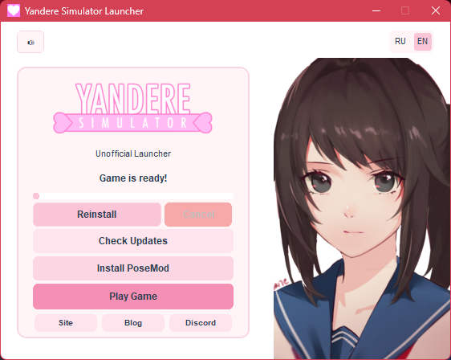

# Yandere Simulator Unofficial Launcher

A lightweight, open-source custom launcher for Yandere Simulator written in Python using CustomTkinter. 

## Features
* **One-Click Installation:** Downloads and extracts the latest version of the game automatically.
* **Update Checker:** Compares file sizes with the official server to notify you about new updates.
* **PoseMod Integration:** Includes a built-in PoseMod installer (extracts directly into the game folder).
* **Bilingual UI:** Supports both English and Russian languages out of the box.
* **Custom Design:** Features a tailored visual style with custom fonts and background music.

## Preview


## How to Run
### Option 1: Standalone Executable (Recommended)
Go to the **Releases** section on the right side of this page, download `YandereLauncher.exe`, and run it.

### Option 2: Run from Source
If you want to run or inspect the source code, make sure you have Python 3.x installed, then install the dependencies:
```bash
pip install customtkinter pillow requests pygame
